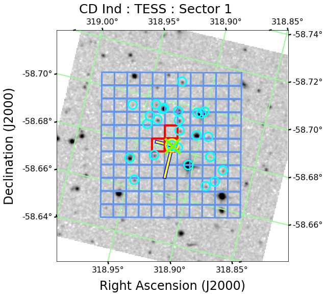
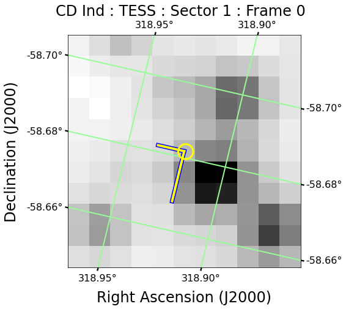

# mkpy3
mkpy3 : Python3 tools for working with data from NASA's Kepler/K2/TESS missions.

Kenneth John Mighell  
Kepler Support Scientist  
Kepler / K2 Science Office  
NASA Ames Research Center / SETI Institute

---

### Example: Kepler mission observations of the exoplanet Kepler-138b

The command
<pre>
python mkpy3_kepler_tpf_overlay_v1.py
</pre>
should produce this plot:

* The finder chart is a 2 arcmin x 2 arcmin field from the 2MASS-J near-infared survey; bright stars are black and the faint background is light-grey/white.

* The red squares show the target aperture pixels of this Kepler mission observation of the exoplanet Kepler-138b (KIC 7603200);
the remaining blue squares show the sky background pixels.

* The yellow circle shows the target of the observation (Kepler 138-b).

* The green X shows the only VSX (International Variable Star Index) variable object in this field (the target object).

* The cyan circles mark nearby GAIA DR2 stars in this field.

The command
<pre>
python mkpy3_kepler_tpf_overlay_v1.py --shrink=0.0
</pre>
turns off the display of the GAIA DR2 and VSX objects.

The command
<pre>
python mkpy3_kepler_tpf_overlay_v1.py --help
</pre>
shows describes all of the argument options of this application.

---

### Example: TESS mission observations of XZ Cyg (a RR Lyrae type variable star)

The command
<pre>
python mkpy3_tess_tpf_overlay_v3.py
</pre>
should produce this plot:

* The finder chart is a 6 arcmin x 6 arcmin field from the 2MASS-J near-infared survey; bright stars are black and the faint background is light-grey/white.

* The coral squares show the target aperture pixels of this TESS mission observation (10x10 TESS FFI cutout) of the RR Lyrae type variable star XZ Cyg.

* The yellow circle shows the target of the observation (XZ Cyg).

* The green X shows the only VSX (International Variable Star Index) variable object in this field (the target object).

* The cyan circles mark nearby GAIA DR2 stars in this field.

